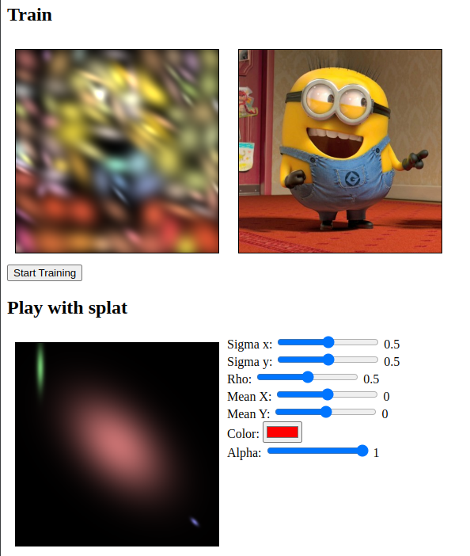

# Fork Gaussian Splatting 2D

The original repository shows in simple Pytorch code how to reproduce an image using 2D splats instead of pixels; and also integrate a splat prune/cloning strategy
I've added:
- python viewer
- web playground to understand how the parameters influence the splat
- web training using tensorflow.js

[web](https://remmel.github.io/Gaussian-Splatting-2D/web)

The below reproduction lasts ~100s using 100 splats with 10x30 iterations. 100 splats is few, but to avoid waiting forever as tfjs uses webgl (and indirectly the GPU - here indirectly my iGPU instead of directly my GPU)
[more info](web/README.md).



# Contribute

## Web
web$ `npx serve`

## Python
pip install ipywidgets matplotlib


# Original Readme:
# Gaussian Splatting 2D
This is a demo of 2d gaussian generating image.
## Features
1. Pre-generate coordinates for drawing gaussian image rather than using grid sample.
2. Speedup training time by using less initialization sample points and increase the number gradually.
3. Use tanh to parse parameters which gives larger gradient at the beginning of training.
4. Less code, easier to understand.
## Usage

```cmd
python run.py
```

With 3000 sample points, you should have at least 16GB gpu memory.
The code only uses L1 loss for supervision. It will be better using other losses.

**Example of 3 random gaussian**


**Result of 10 epoch**


## Reference
[Gaussian Splatting](https://github.com/graphdeco-inria/gaussian-splatting)

[2D-Gaussian-Splatting](https://github.com/OutofAi/2D-Gaussian-Splatting)
